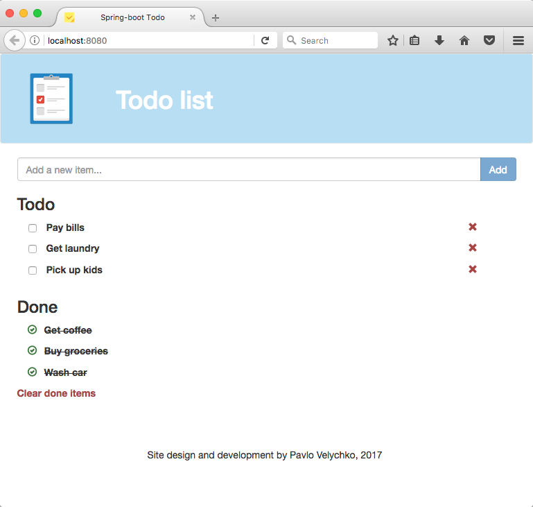

# Spring-boot todo

##Introduction

A maven-based Spring Boot Application, that provides a basic to-do web application. 

For the database used PostgreSQL, in particular database as a service solution from ElephantSQL. 

As a front-end used Handlebars.js javaScript templating engine and Twitter Bootstrap that connects the data to the given HTML/JavaScript templates.

## How to launch

The application should start with the following command:
```
mvn spring-boot:run
```

## Screenshots


